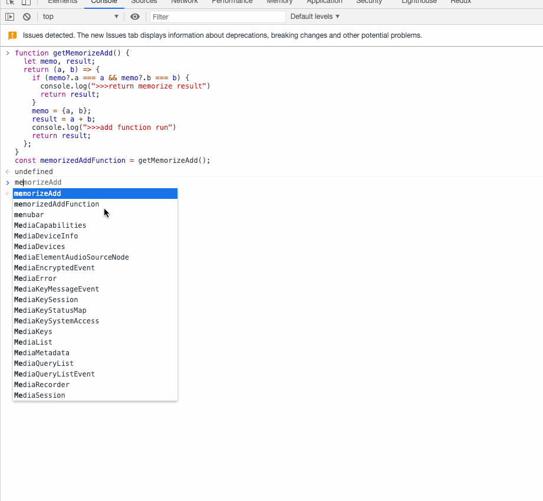
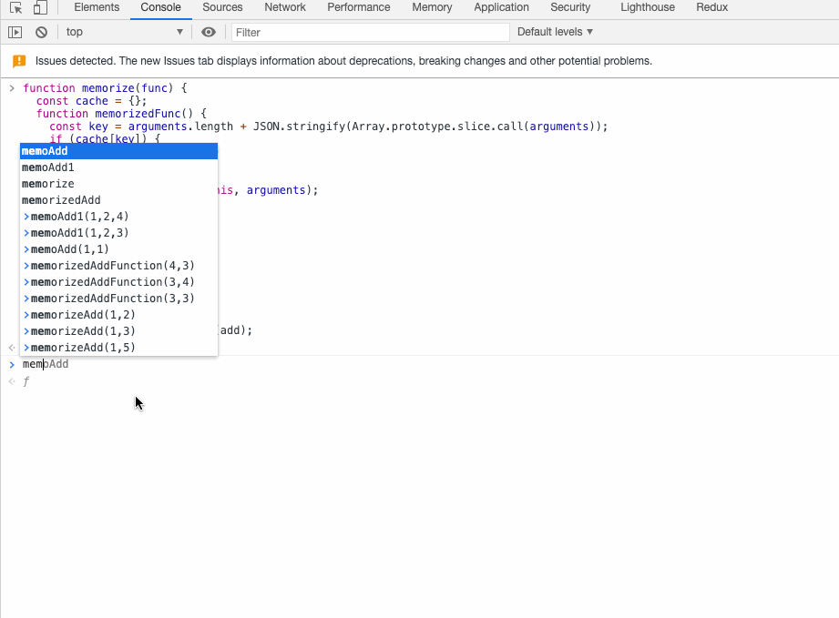

# memorize function 记忆函数

传相同的参数给一个记忆函数，该函数会直接返回上次结果

下面实现一个最简单的 带记忆功能的add函数：

```javascript
// 有记忆功能的 add 函数
function getMemorizeAdd() {
  let memo, result;
  return (a, b) => {
    if (memo?.a === a && memo?.b === b) {
      console.log(">>>return memorize result")
      return result;
    }
    memo = {a, b};
    result = a + b;
    console.log(">>>add function run")
    return result;
  };
}
const memorizedAddFunction = getMemorizeAdd();
```

memorizedAddFunction运行效果如图：如果传入相同的参数直接返回之前记住的结果，否则才进行加运算



其实可以实现一个高阶 memorize 函数，把传入的函数变成记忆函数。

```javascript
function memorize(func) {
  const cache = {};
  function memorizedFunc() {
    const key = arguments.length + JSON.stringify(Array.prototype.slice.call(arguments));
    if (cache[key]) {
      console.log('>>>>>memo')
      return cache[key]
    }
    cache[key] = func.apply(this, arguments);
    console.log(">>>>>run")
    return cache[key];
  }
  return memorizedFunc;
}

function add (a, b, c) {
  return a + b + c;
}

const memorizedAdd = memorize(add);
```

